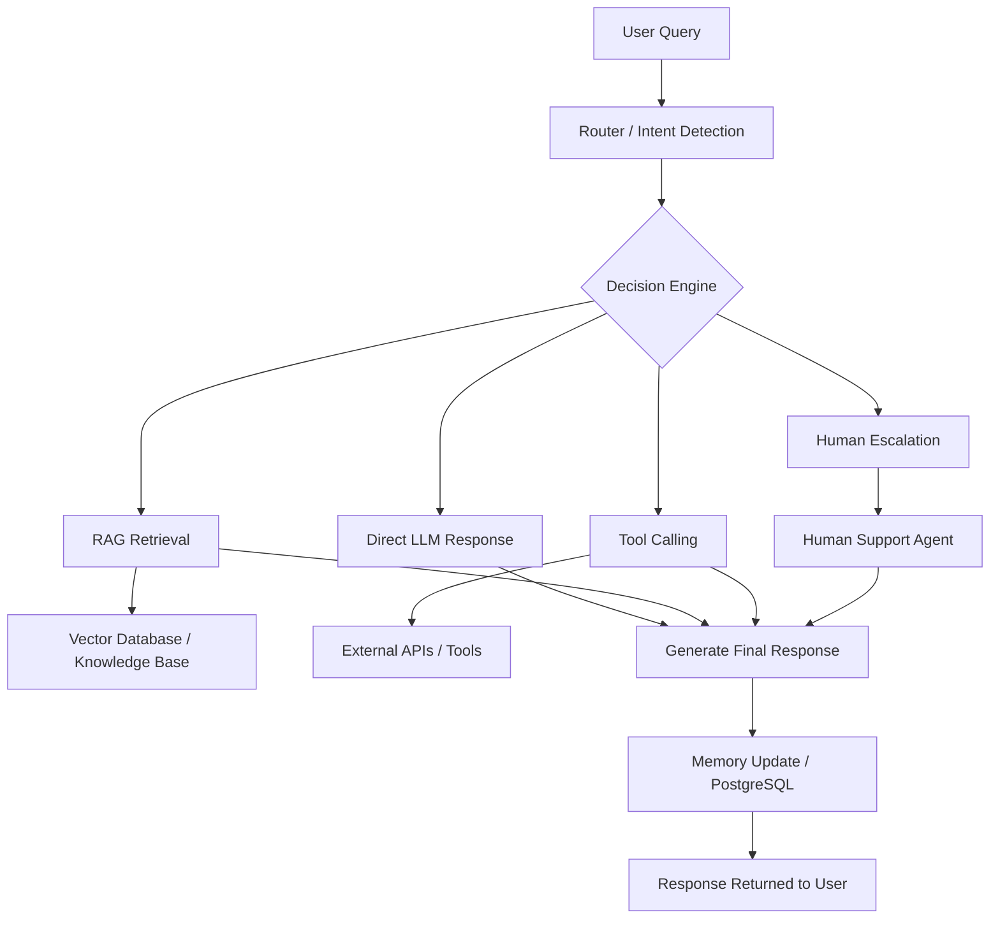

# AI Customer Support Agent

An intelligent AI-powered customer support system built using LangGraph, RAG, tool calling, and conversational memory.

## Features

- Conversational AI support agent
- Retrieval-Augmented Generation (RAG)
- Tool calling support
- Human escalation workflow
- Persistent conversational memory
- PostgreSQL checkpointing
- LangGraph workflow orchestration
- Streamlit frontend
- Modular agent architecture

---

## Tech Stack

- Python
- LangGraph
- LangChain
- Groq API
- PostgreSQL
- Streamlit
- FAISS / Vector Database

---



## Project Structure

```bash
customer_support_agent/
│── app.py
│── graph.py
│── nodes.py
│── router.py
│── rag.py
│── tools.py
│── state.py
│── setup_db.py
│── requirements.txt
│── .env
│── .gitignore
│── README.md
│── data/

System Workflow
User submits a query
Router analyzes intent
Agent dynamically decides whether to:
Respond directly
Retrieve context using RAG
Call external tools
Escalate to a human agent
Conversation state is maintained using memory
Final response is returned to the user
Core Capabilities
RAG Pipeline

Uses Retrieval-Augmented Generation to fetch relevant information from external knowledge sources before generating responses.

Tool Calling

The agent can intelligently decide when to use external tools and APIs during conversations.

Human Escalation

If the model is uncertain or unable to confidently respond, queries can be escalated to a human support workflow.

Conversational Memory

Maintains context across interactions for more natural and personalized conversations.

Stateful Workflows

Powered by LangGraph to create structured, controllable AI agent workflows.

Setup Instructions
1. Clone Repository
git clone https://github.com/YOUR_USERNAME/customer-support-agent.git
cd customer-support-agent
2. Create Virtual Environment
python -m venv venv
source venv/bin/activate
3. Install Dependencies
pip install -r requirements.txt
4. Configure Environment Variables

Create a .env file:

GROQ_API_KEY=your_api_key
DATABASE_URL=your_postgresql_database_url
5. Run Application
streamlit run app.py
Future Improvements
Voice-enabled customer support
Multi-agent collaboration
Advanced observability and tracing
Admin dashboard and analytics
Confidence scoring for hallucination prevention
Automated ticket generation
Production deployment pipeline
Use Cases
Customer support automation
AI helpdesk systems
Internal enterprise assistants
SaaS onboarding assistants
Technical support agents
Knowledge-base chat systems
Author

Aditya Oza

GitHub: https://github.com/aditya0za005-ux
